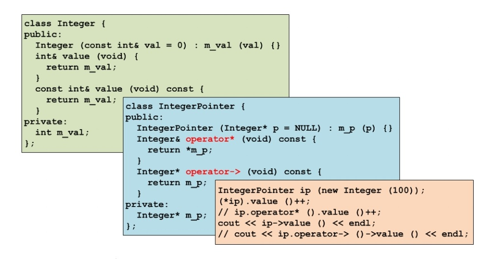

# 解引用和间接成员访问操作符：*、->

* 如果一个重载了解引用和间接成员访问操作符，那么该类的对象就可以被当做指针来使用
    
    

# 智能指针（auto_ptr）

## 常规指针的缺点

* 当一个常规指针离开它的作用域时，只有该指针变量本身所占据的内存空间（通常是4字节）会被释放，而它所指向的动态内存并未得到释放
* 在某些特殊情况下，包含`free/delete/delete[]`的代码根本执行不到，形成内存泄漏

## 智能指针的优点

* 智能指针是一个封装了常规指针的类类型对象，当它离开作用域时，其析构函数负责释放该常规指针所指向的动态内存
* 以正确方式创建智能指针，其析构函数总会执行

## 智能指针与常规指针的一致性

* 为了使智能指针也能像常规指针一样，通过`*`操作符解引用，通过`->`操作符访问其目标的成员，就需要对这两个操作进行重载

## 智能指针与常规指针的不一致性

* 任何时候，针对同一个对象，只允许有一个智能指针持有其地址，否则该对象在多个智能指针中被析构多次（double free）
* 智能指针的拷贝构造和拷贝赋值需要做特殊处理，对其所持有的对象地址，以指针间的转移代替复制
* 智能指针的转移语义与常规指针的复制语义不一致

